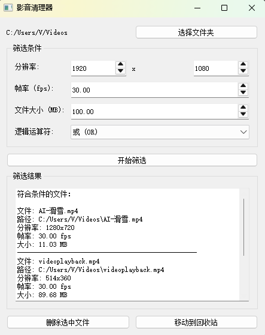

# 影音清理器

一个使用 Python 和 PyQt5 开发的影音文件清理工具，可以根据用户指定的条件（分辨率、帧率、文件大小）筛选并清理影音文件。

## 功能特点

*   选择影音文件所在文件夹
*   设置筛选条件（分辨率、帧率、文件大小）
*   支持与 (AND) 和或 (OR) 逻辑运算符
*   显示符合条件的文件列表（文件名、路径、分辨率、帧率、大小）
*   删除符合条件的文件
*   将符合条件的文件移动到回收站
*   支持多种视频格式（mp4, avi, mkv, mov, wmv, flv, webm）
*   筛选条件支持"小于"比较（筛选出低于指定条件的文件）



## 项目结构

```
.
├── main.py              # 程序入口
├── ui.py               # 用户界面相关代码
├── video_processor.py  # 视频处理逻辑
├── requirements.txt    # 项目依赖
└── README.md          # 项目说明
```

## 依赖要求

*   Python 3.6+
*   PyQt5
*   moviepy
*   send2trash

## 安装步骤

1.  克隆或下载此仓库：

    ```bash
    git clone https://github.com/yourusername/VedioCleaner.git
    cd VedioCleaner
    ```

2.  安装依赖：

    ```bash
    pip install -r requirements.txt
    ```

3.  确保系统中已安装 ffmpeg：

    *   Windows: 从 [ffmpeg 官网](https://ffmpeg.org/download.html) 下载并安装
    *   Linux: `sudo apt-get install ffmpeg`
    *   macOS: `brew install ffmpeg`

## 使用方法

1.  运行程序：

    ```bash
    python main.py
    ```

2.  在打开的窗口中：
    *   点击"选择文件夹"按钮，选择包含影音文件的文件夹
    *   在"筛选条件"区域设置所需的筛选条件：
        *   分辨率：设置最大宽度和高度（将筛选出小于此分辨率的文件）
        *   帧率：设置最大帧率（fps）（将筛选出小于此帧率的文件）
        *   文件大小：设置最大文件大小（MB）（将筛选出小于此大小的文件）
        *   逻辑运算符：选择"与 (AND)"或"或 (OR)"
    *   点击"开始筛选"按钮，程序将开始扫描文件夹并筛选文件
    *   筛选结果将显示在"筛选结果"区域
    *   点击"删除选中文件"按钮可以删除筛选出的文件
    *   点击"移动到回收站"按钮可以将文件移动到回收站

## 筛选逻辑说明

*   分辨率筛选：筛选出宽度和高度都小于指定值的文件
*   帧率筛选：筛选出帧率小于指定值的文件
*   文件大小筛选：筛选出文件大小小于指定值的文件
*   逻辑运算符：
    *   与 (AND)：所有条件都必须满足
    *   或 (OR)：满足任意一个条件即可

## 注意事项

*   删除文件操作不可逆，请谨慎使用
*   移动到回收站功能需要安装 `send2trash` 库
*   程序使用 `moviepy` 读取视频元数据，请确保系统中已安装 `ffmpeg`
*   建议在操作前备份重要文件
*   筛选条件使用"小于"比较，即筛选出低于指定条件的文件

## 开发说明

*   `main.py`: 程序入口，负责启动应用程序
*   `ui.py`: 包含所有 UI 相关的代码，负责用户界面的显示和交互
*   `video_processor.py`: 包含视频处理相关的逻辑，负责视频文件的扫描、筛选和操作

## 贡献指南

欢迎提交 Issue 和 Pull Request 来帮助改进这个项目。

## 许可证

MIT License 